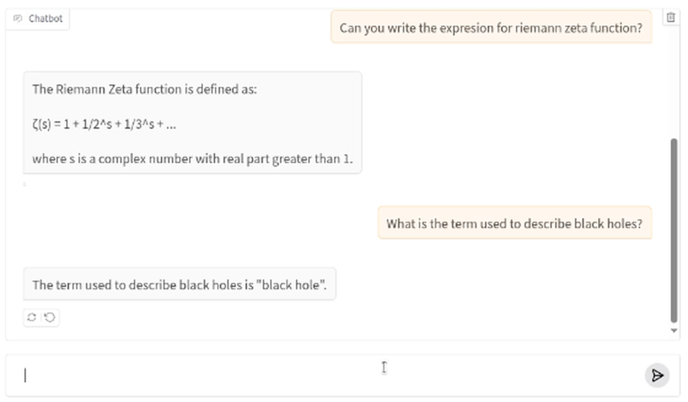

<h1 style="color:#1abc9c;">QwenPhysics: Fine-Tuning de QWEn2.5-3B con Artículos de Física de arXiv</h1>

  - [Objetivo de la aplicación](#objetivo-de-la-aplicación)
  - [Modelos empleados](#modelos-empleados)
  - [Tecnologías Utilizadas](#tecnicas-utilizadas)
  - [Instalación y Ejecución](#cómo-instalar-la-aplicación-y-las-dependencias)
  - [Cómo ejecutar la aplicación](#como-ejecutar-la-aplicación)
  - [Posibles mejoras Futuras](#posibles-mejoras-futuras)

## Objetivo de la aplicación

El objeto principal de este proyecto es definir y desarrollar un prototipo de aplicación para la generación de texto en un ámbito más exigente de lo convencional como es la Física. Es sabido por los usuarios que los modelos generativos carecen en muchas ocasiones de coherencia lógica-matemática y de conocimiento específico en áreas científico-técnicas. Por esto, dentro del hardware del que disponemos y la limitación de recursos, se realiza *fine-tuning* de un modelo Qwen preentrenado, con el fin de mejorar su rendimiento en tareas triviales relacionadas con la física.

Además, se pondrá a prueba en el contexto de entrenamiento para evaluar su rendimiento y ver si es capaz de generar texto coherente. Revisar [video](./Video/QwenPhysics.mp4) adjunto para ver el funcionamiento de la aplicación.

## Modelos empleados

El modelo base preentrenado, sin tener en cuenta la cuantización, es el Qwen versión 2.5 de 3 billones de parámetros. Este modelo ha sido desarrollado por Alibaba Group, especializado en instrucciones y generación de código. Cabe destacar su capacidad para generar texto en múltiples idiomas y sus capacidades de razonamiento lógico y matemático fundamental. Además, es compatible con llama.cpp y herramientas de cuantización y ajuste fino (QLoRa, LoRa). Aunque en este desarrollo no se le va a sacar partido, soporta *tool-calling* para invocar funciones externas (cálculo, búsqueda web, APIs de datos) mediante plantillas de *chat templates* específicas.

## Tecnicas utilizadas

Para obtener el modelo final, es decir, nuetro modelo *finetunned*, se ha empleado la técnica de cuantización QLoRa, que permite reducir el tamaño del modelo y mejorar su rendimiento en tareas específicas. El entrenamiento se ha realizado empleando SFTrainer con precisión float16. Finalmente se ha guardado el modelo cuantizado en formato GGUF con el fin de tener un modelo optimizado, que consume menos memoria a costa de una ligera pérdida de precisión y, por otro lado, se ha guardado una versión LoRa del modelo, que permite un ajuste fino más eficiente y rápido.

Aunque la técnica principal de nuestra aplicación se basa en **Fine-Tuning**, se ha empleado la técnica de **prompt engineering** para mejorar el rendimiento del modelo en tareas específicas. Esta técnica consiste en diseñar y ajustar los mensajes de entrada al modelo para obtener respuestas más precisas y relevantes. Por ejemplo:

- **System Prompt Especializado**: Configuración del modelo con un prompt de sistema "*You are an expert physics assistant*" para orientar sus respuestas hacia el dominio de la física.
- **Formato ChatML**: Implementación del formato conversacional ChatML para una estructura clara de roles que mejora la comprensión contextual.
- **Optimización de Parámetros de Inferencia**: Ajuste de temperatura (0.1) para favorecer respuestas deterministas en cálculos y conceptos científicos.
- **Conversaciones Estructuradas**: Entrenamiento con ejemplos que mantienen una estructura consistente de sistema-usuario-asistente para mejorar la coherencia del modelo.

*Para más detalle: [QwenPhysics.ipynb](./QwenPhysics.ipynb)

## Cómo instalar la aplicación y las dependencias

Si se emplea Google Colab, no es necesario instalar ninguna dependencia local ya que el entorno ya cuenta con las librerías necesarias para ejecutar la aplicación. Este es el entorno que se ha empleado para el desarrollo de la aplicación. 

Por el contrario, si se quiere ejecutar en local, es recomendable usar los entornos de Anaconda, Python o Miniconda, ya que permiten crear entornos virtuales y gestionar las dependencias de manera más eficiente.

Anaconda o Miniconda:

```bash
# Crear un nuevo entorno conda
conda create -n qwenphysics python=3.10
conda activate qwenphysics

# Instalar PyTorch con soporte CUDA 
conda install pytorch torchvision pytorch-cuda=12.4 -c pytorch -c nvidia

pip install -r requirements.txt

pip install llama-cpp-python --extra-index-url https://abetlen.github.io/llama-cpp-python/whl/cu124
```

Instalación en un entorno virtual de Python:

```bash
# Crear y activar entorno
python -m venv qwenphysics_env
# En Windows:
qwenphysics_env\Scripts\activate
# En Linux/Mac:
source qwenphysics_env/bin/activate

pip install -r requirements.txt

pip install llama-cpp-python --extra-index-url https://abetlen.github.io/llama-cpp-python/whl/cu124
```

## Como ejecutar la aplicación

La ejecución de la aplicación se puede ver en el documento [QwenPhysics.ipynb](./QwenPhysics.ipynb) adjunto. Principalmente debemos cargar nuestro modelo ya entrenado; ya bien sea nuestro modelo LoRa, el modelo cuantizado o la versión en float16. Ambas versiones las podemos en contrar en el siguiente [enlace](https://huggingface.co/AigarciabFabero/QwenPhysics-Q4_k_M/tree/main) (excepto LoRa).

```python
# Import necessary libraries
from langchain_community.chat_models import ChatLlamaCpp
import gradio as gr
from huggingface_hub import hf_hub_download

model_path = hf_hub_download(
    repo_id  = "AigarciabFabero/QwenPhysics-Q4_k_M",
    # filename = "QwenPhysics-F16.gguf",
    filename = "QwenPhysics-Q4_K_M.gguf",
    force_download = False,
)

llm = ChatLlamaCpp(
    model_path=model_path,
    n_gpu_layers=25,
    stop=["<|im_end|>\n"],
    n_ctx=4096,
    max_tokens=4096,
    streaming=True,
    n_batch=256,
    temperature=0.1,
)
```

Una vez cargado nuestro modelo, se lanza junto a un chatbot con ayuda de gradio. En esta situación, se ha empleado un *chatbot* que permite la interacción con el modelo y la generación de texto en tiempo real. 

```python
# Create the llama handler
def llama_cpp(message, history):

    messages = history + [
        {
            "role": "user",
            "metadata": None,
            "content": message,
            "options": None,
        }
    ]

    with open('messages.txt', 'w') as f:
      f.write(str(messages))
    response = ""

    for c in llm.stream(messages):
        response += c.content
        yield response

# Create and launch the web chatbot
demo = gr.ChatInterface(
    llama_cpp,
    type="messages",
    flagging_mode="manual",
    flagging_options=[],
    save_history=True,
)

if __name__ == "__main__":
    demo.launch()
```

Una vez hemos lanzado el *chatbot*, podemos interactuar con el modelo y ver su rendimiento en tiempo real. En el caso de este proyecto, se ha empleado un conjunto de datos de artículos de física extraídos de arXiv, que se han utilizado para entrenar el modelo y mejorar su rendimiento en tareas específicas relacionadas con la física.



**Algunas cuestiones para evaluar el modelo:**

| Pregunta | Respuesta |
|----------|-----------|
| Riemann zeta function? | The Riemann zeta function is a mathematical function that was first studied by the mathematician Bernhard Riemann in the mid-nineteenth century. It is defined as:<br><br>ζ(s) = 1/1^s + 1/2^s + 1/3^s + 1/4^s + ...<br><br>for complex values of s with real part greater than 1. The series in the definition converges absolutely for those values of s.<br><br>The Riemann zeta function has many interesting and important properties. For example, it can be used to study the distribution of prime numbers, and the famous Riemann hypothesis, which remains unsolved, asserts that all nontrivial zeros of the function occur on the critical line s = 1/2.<br><br>The study of the Riemann zeta function is an active area of research in number theory and has connections to many other areas of mathematics and physics. |
| When was the michelson morley experiment? | The Michelson-Morley experiment was conducted in 1887. |
| Can you write the expresion for riemann zeta function? | ζ(s) = 1/1^s + 1/2^s + 1/3^s + 1/4^s + ... |
| What is the term used to describe black holes? | The term used to describe black holes is "singularity". It refers to the point in space-time where the gravitational force is so strong that it causes the collapse of matter into an infinitely small and dense point. |

**Pregunta extra por curiosidad de ver hasat que punto Qwuen tiene razonamiento lógico-matemático:**

- ES: ¿Cuánto vale una integral de una función impar definida en un intervalo simétrico centrada en el origen? EN: What is the value of an integral of an odd function defined on a symmetric interval centered at the origin? Respuesta/answer: 0 or null.

## Posibles mejoras futuras

- Emplear un modelo más exigente, como el Qwen 7B o 13B.

- Emplear el conjunto de datos de arXiv en su totalidad, para mejorar el rendimiento del modelo. Y tener así un amplico contexto de entrenamiento.

- Entrenar otro modelo con un conjunto de datos diferente del ámbito de la fisica (Lecturas de Feynman) y mergear ambos modelos para obtener un modelo más potente.